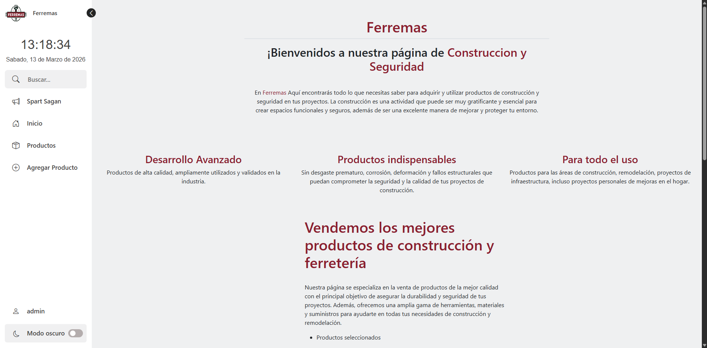
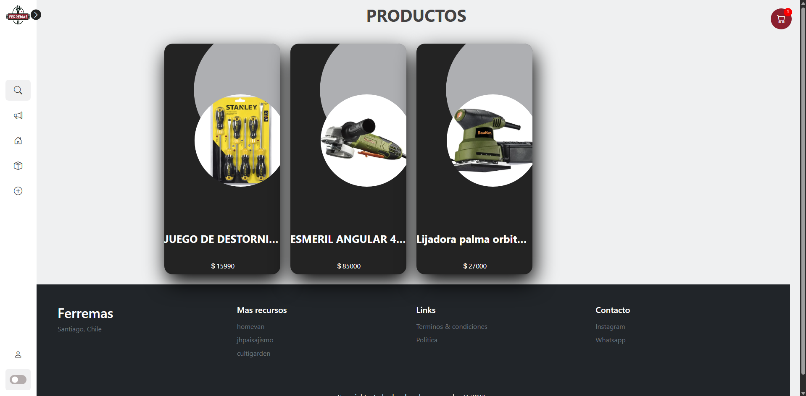
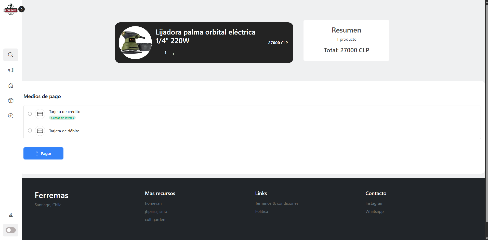
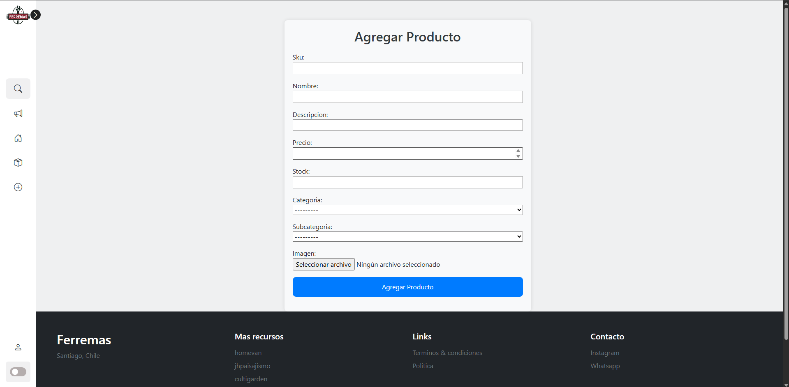

# Ferremas

Ferremas es una aplicación web desarrollada con Django que simula un e-commerce de ferretería.  
Incluye catálogo de productos, autenticación de usuarios, carrito de compras y procesamiento de pagos mediante Mercado Pago.


## Demo

**Aplicación en vivo:**  
https://ferremas.onrender.com

### Credenciales de prueba

Cliente  
usuario: Prueba  
password: prueba  

Administrador  
usuario: admin  
password: admin


---

## Screenshots






---

## Stack tecnológico

Backend
- Python
- Django
- SQLite

Frontend
- HTML
- CSS
- JavaScript
- Bootstrap 5

Servicios externos
- Mercado Pago API

---

## Desafíos técnicos

- Integración de Mercado Pago para generar preferencias de pago.
- Implementación de autenticación personalizada con `AbstractUser`.
- Gestión de roles (`admin` y `cliente`).
- Sistema de carrito con actualización dinámica de cantidades.
- Implementación del flujo completo de compra: carrito → creación de orden → pago → confirmación de compra.

---

## Funcionalidades

- Catálogo de productos con stock e imágenes.
- Registro e inicio de sesión de usuarios.
- Carrito de compras.
- Procesamiento de pagos con Mercado Pago.
- Panel de administración para agregar productos

---

## Instalación

```bash
git clone https://github.com/AngelCzu/Examen_Integracion
cd Ferremas
python -m venv venv
venv\Scripts\activate
pip install -r requirements.txt
python manage.py migrate
python manage.py runserver
```

---

## Autor

Angel Gabriel Cea Zúñiga
Desarrollador de Software Junior